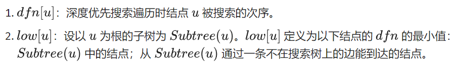
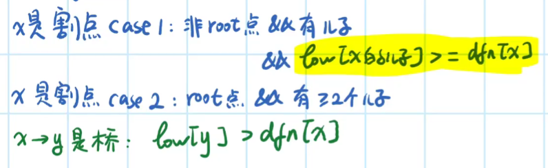

# 树

### 最近公共祖先（LCA）

```c++
#include <bits/stdc++.h>

#define MXN 500005
using namespace std;
std::vector<int> v[MXN];

int fa[MXN][31], dep[MXN];
int n, m, s;
int a, b;

// dfs，用来为 lca 算法做准备。接受两个参数：dfs 起始节点和它的父亲节点。
void dfs(int root, int fno) {
    // 初始化：第 2^0 = 1 个祖先就是它的父亲节点，dep 也比父亲节点多 1。
    fa[root][0] = fno;
    dep[root] = dep[fa[root][0]] + 1;
    // 初始化：其他的祖先节点：第 2^i 的祖先节点是第 2^(i-1) 的祖先节点的第
    // 2^(i-1) 的祖先节点。
    for (int i = 1; i < 31; ++i) {
        fa[root][i] = fa[fa[root][i - 1]][i - 1];
    }
    // 遍历子节点来进行 dfs。
    int sz = v[root].size();
    for (int i = 0; i < sz; ++i) {
        if (v[root][i] == fno) continue;
        dfs(v[root][i], root);
    }
}

// lca。用倍增算法算取 x 和 y 的 lca 节点。
int lca(int x, int y) {
    // 令 y 比 x 深。
    if (dep[x] > dep[y]) swap(x, y);
    // 令 y 和 x 在一个深度。
    int tmp = dep[y] - dep[x];
    for (int j = 0; tmp; ++j, tmp >>= 1)
        if (tmp & 1)  y = fa[y][j];
    // 如果这个时候 y = x，那么 x，y 就都是它们自己的祖先。
    if (y == x) return x;
    // 不然的话，找到第一个不是它们祖先的两个点。
    for (int j = 30; j >= 0 && y != x; --j) {
        if (fa[x][j] != fa[y][j]) {
            x = fa[x][j];
            y = fa[y][j];
        }
    }
    // 返回结果。
    return fa[x][0];
}

int main() {
    // 读入树：节点数一共有 n 个。
    cin >> n >> m >> s;
    for (int i = 1; i < n; ++i) {
        cin >> a >> b;
        v[a].push_back(b);
        v[b].push_back(a);
    }
    // 为了计算 lca 而使用 dfs。
    dfs(s, 0);
    for (int i = 0; i < m; ++i) {
        cin >> a >> b;
        cout << lca(a, b) << endl;
    }
    return 0;
}
```

### 树的重心

定义：对于树上的每一个点，计算其所有子树中最大的子树节点数，这个值最小的点就是这棵树的重心。

```c++
//算法核心为：num[curr][fai] = n - sum - 1;
//套这个模板之前先想想能不能用其他所有子树的目标值算出父子树的目标值

#include <iostream>
#include <vector>
#define mxn 20005
using namespace std;
int caseNum, n, a, b;
vector<int> v[mxn];		//v[i][j]表示第i个结点的第j个邻结点
vector<int> num[mxn];	//num[i][j]表示第i个结点的第j棵子树结点数
int minNum, minCurr;	//minNum存放最小子树结点数，minCurr存放重心位置

int getCentroid(int curr, int fa) {
    int fai, sum = 0, maxCurrNum = 0;	
    //当前结点的第fai个邻结点为父节点
    //sum为当前结点除父节点子树以外所有子树节点之和
    //maxCurrNum为当前结点所有子树结点数中最大的
    for (int i = 0; i < v[curr].size(); i++) {
        if (v[curr][i] == fa) {
            fai = i;
            continue;
        }
        num[curr][i] = getCentroid(v[curr][i], curr);
        sum += num[curr][i];
        maxCurrNum = max(maxCurrNum, num[curr][i]);
    }
    if (curr!=1) num[curr][fai] = n - sum - 1;
    maxCurrNum = max(maxCurrNum, num[curr][fai]);
    if (minNum > maxCurrNum) {
        minNum = maxCurrNum;
        minCurr = curr;
    }
    return sum + 1;
}

void init()
{
    for (int i=1;i<=n;i++){
        v[i].clear();
        num[i].clear();
    }
}
int main() {
    cin >> caseNum;		//caseNum次测试
    for (int i = 1; i <= caseNum; i++) {
        init();
        cin >> n;
        minNum = n + 1;
        for (int j = 1; j < n; j++) {
            cin >> a >> b;
            v[a].push_back(b);
            num[a].push_back(0);
            v[b].push_back(a);
            num[b].push_back(0);
        }
        getCentroid(1, 0);
        cout << minCurr << " " << minNum << endl;
    }
    return 0;
}
```

### 树的中心

```c++
//两次dfs，中心思想依旧是dp

#include <bits/stdc++.h>
#define mxn 100005
using namespace std;
int n, a, b;
vector<int> v[mxn];        //v[i][j]表示第i个结点的第j个邻结点
vector<int> num[mxn];    //num[i][j]表示第i个结点的第j棵子树方向的离心率（最远距离）
int minDis, center;    //minDis存放中心的离心率，center存放中心

int dfs(int curr, int fa) {
    //先dfs把除父节点方向的所有离心率填完
    int maxDist = 0;    //maxDist为当前结点除父节点外所有方向中最大的离心率
    for (int i = 0; i < v[curr].size(); i++) {
        if (v[curr][i] == fa) continue;
        num[curr][i] = dfs(v[curr][i], curr) + 1;
        maxDist = max(maxDist, num[curr][i]);
    }
    return maxDist;
}

void repair(int curr, int fa, int faMaxDist) {
    //再把每个结点的父节点方向的离心率填上
    //faMaxDist为父节点除了往curr方向外其他方向最大的离心率
    int first = 0, second = 0;
    //先把父节点方向的离心率填上，选出所有方向离心率中最大的两个
    for (int i = 0; i < v[curr].size(); i++) {
        if (v[curr][i] == fa) {
            num[curr][i] = faMaxDist + 1;
            if (num[curr][i] > first) {
                second = first;
                first = num[curr][i];
            } else if (num[curr][i] > second) second = num[curr][i];
        }
        if (num[curr][i] > first) {
            second = first;
            first = num[curr][i];
        } else if (num[curr][i] > second) second = num[curr][i];
    }
    //更新minDis
    if (first < minDis) {
        minDis = first;
        center = curr;
    }
    //向下dfs
    for (int i = 0; i < v[curr].size(); i++) {
        if (v[curr][i] == fa) continue;
        if (num[curr][i] == first) repair(v[curr][i], curr, second);
        else repair(v[curr][i], curr, first);
    }
}

int main() {
    cin >> n;
    minDis = n + 1;
    for (int j = 1; j < n; j++) {
        cin >> a >> b;
        v[a].push_back(b);
        num[a].push_back(0);
        v[b].push_back(a);
        num[b].push_back(0);
    }
    dfs(1, 0);
    repair(1, 0, 0);
    cout << center << " " << minDis;
    return 0;
}
```

# 最短路

### floyd

### dijkstra

# 最小生成树

### kruskal算法

#### （并查集优化 只存边）

```c++
#include <bits/stdc++.h>
using namespace std;
int n, m, u, v, w, sum = 0;	//n个点,m条已知边，sum为最小生成树权值和
typedef struct {
    int u, v;
    int w;
} edge;
vector<edge> e;
vector<int> fa;	//fa数组用来查找结点祖先

int cmp(const void *p1, const void *p2) {	//自定义比较函数，传入qsort
    edge *e1 = (edge *) p1;
    edge *e2 = (edge *) p2;
    if (e1->w > e2->w) return 1;
    else if (e1->w < e2->w) return -1;
    return 0;
}

int find(int i) {	//查找祖先
    if (fa[i] == 0) return 0;
    while (fa[i] != i) i = fa[i];
    return i;
}

void kruskal() {
    //edgeNum为已纳入的边，i为游标，指向e中当前遍历到的边
    int edgeNum = 0, i = 0;	
    while (edgeNum < n && i < e.size()) {
        if (e[i].u==e[i].v){    //排除u=v的情况
            i++;
            continue;
        }
        //先分别找到两个点的祖先
        int uRoot = find(e[i].u);
        int vRoot = find(e[i].v);
        if (uRoot != 0 && vRoot != 0) {
            if (uRoot != vRoot) {
                fa[uRoot] = vRoot;
            } else {
                i++;
                continue;
            }
        } else if (uRoot == 0 && vRoot == 0) {
            fa[e[i].u] = e[i].u;
            fa[e[i].v] = e[i].u;
        } else if (uRoot == 0) {
            fa[e[i].u] = vRoot;
        } else fa[e[i].v] = uRoot;
        sum += e[i].w;
        edgeNum++;
        i++;
    }
}

int main() {
    cin >> n >> m;
    e.resize(m);
    fa.resize(n + 1);
    for (int i = 0; i < m; i++) {
        cin >> u >> v >> w;
        e[i].u = u;
        e[i].v = v;
        e[i].w = w;
    }
    qsort(&e[0], m, sizeof(edge), cmp);	//STL内置快速排序
    kruskal();
    return 0;
}
```


# 连通性相关

### 强连通分量

#### Tarjan

[bilibili](https://www.bilibili.com/video/BV19J411J7AZ?p=4) : 算法运行过程理解



伪代码：

```c++
TARJAN_SEARCH(int u)
    vis[u]=true
    low[u]=dfn[u]=++dfncnt
    push u to the stack
    for each (u,v) then do
        if v hasn't been search then
            TARJAN_SEARCH(v) // 搜索
            low[u]=min(low[u],low[v]) // 回溯
        else if v has been in the stack then
            low[u]=min(low[u],dfn[v])
```

代码：

```c++
#include <bits/stdc++.h>
#define mxn 100
using namespace std;

stack<int> s;
vector<int> v[mxn];        //v[i][j]表示第i个结点的第j个邻结点
vector<int> scc,sz,dfn,low;  // scc 为结点 i 所在强连通分量的编号 , sz 为强连通分量 i 的规模（！注意是从0开始）,dfn（时间戳），low(够追溯到的最早的栈中节点的次序号)
vector<bool> in_stack;
int n,a,b,dfncnt;

void tarjan(int u) {
    low[u] = dfn[u] = ++dfncnt, s.push(u), in_stack[u] = true;
    for (int i = 0;i<v[u].size();i++) {
        int next=v[u][i];
        if (!dfn[next]) {
            tarjan(next);
            low[u] = min(low[u], low[next]);
        } else if (in_stack[next]) {
            low[u] = min(low[u], dfn[next]);
        }
    }
    if (dfn[u] == low[u]) {
        int sc=sz.size();     //sc为新的强连通分量下标，从0开始
        int SccSize=0;
        while (s.top() != u) {
            scc[s.top()] = sc;
            SccSize++;
            in_stack[s.top()] = false;
            s.pop();
        }
        scc[s.top()] = sc;
        SccSize++;
        in_stack[s.top()] = false;
        s.pop();

        sz.push_back(SccSize);
    }
}

int main()
{
    cin>>n;
    for (int j = 1; j < n; j++) {
        cin >> a >> b;
        v[a].push_back(b);
    }
    return 0;
}
```

### 割点和桥

#### Tarjan

判断准则：




```c++
//割点
#include <bits/stdc++.h>

using namespace std;
int n, m;  // n：点数 m：边数
int dfnCount, res;  // dfnCount：时间戳，res：答案数量
vector<vector<int>> v;
vector<int> dfn, low;   // dfn：记录每个点的时间戳 low：能不经过父亲到达最小的编号
vector<bool> vis, flag;  // flag: 答案 vis：标记是否重复

void Tarjan(int u, int father) {  // u 当前点的编号，father 自己爸爸的编号
    vis[u] = true;                  // 标记
    low[u] = dfn[u] = ++dfnCount;  // 打上时间戳
    int child = 0;             // 每一个点儿子数量
    for (auto node: v[u]) {   // 访问这个点的所有邻居 （C++11）
        if (!vis[node]) {
            child++;                       // 多了一个儿子
            Tarjan(node, u);                  // 继续
            low[u] = min(low[u], low[node]);  // 更新能到的最小节点编号
            if (father != u && low[node] >= dfn[u] && !flag[u]) {  // case 1
                // 如果当前结点u不是root，且u满足low[u的儿子] >= dfn[u]
                flag[u] = true;
                res++;  // 记录答案
            }
        } else if (node != father) low[u] = min(low[u], dfn[node]);  // 遍历到已访问过的点，更新low[u]
    }
    if (father == u && child >= 2 && !flag[u]) {  // case 2
        // 如果当前结点u是root,且满足u有两个及以上儿子
        flag[u] = true;
        res++;  // 记录答案
    }
}

void init() {
    cin >> n >> m;                  // n个点，m条边
    dfn.resize(n + 1);
    low.resize(n + 1);
    v.resize(n + 1);
    vis.resize(n + 1);
    flag.resize(n + 1);
    for (int i = 1; i <= m; i++) {  // 注意点是从 1 开始的
        int x, y;
        cin >> x >> y;
        if (x != y) {
            v[x].push_back(y);
            v[y].push_back(x);
        }
    }
}

int main() {
    init();
    for (int i = 1; i <= n; i++)  // 因为 Tarjan 图不一定连通
        if (!vis[i]) {
            dfnCount = 0;      // 时间戳初始为 0
            Tarjan(i, i);  // 从第 i 个点开始，父亲为自己
        }
    cout << res << endl;
    for (int i = 1; i <= n; i++)
        if (flag[i]) cout << i << " ";  // 输出结果
    return 0;
}
```

### 有向图补全成强连通最少添加边数

1. 先用Tarjan算法完成缩点操作获得新图
2. 求出新图中入度为0的点个数countIn，出度为0的点个数countOut，最少边数即为max(countIn,countOut)
3. 别忘了对本身就已经强连通的图进行特判

> 证明：将那些出度和入度为0的点都连起来
>
> 1. 若此时已经为强连通，结束
> 2. 若此时不为强连通，则必有两个环由一条有向边相连，此时从一个环中取出一条边与另一个环相连，这两个环就强连通了

