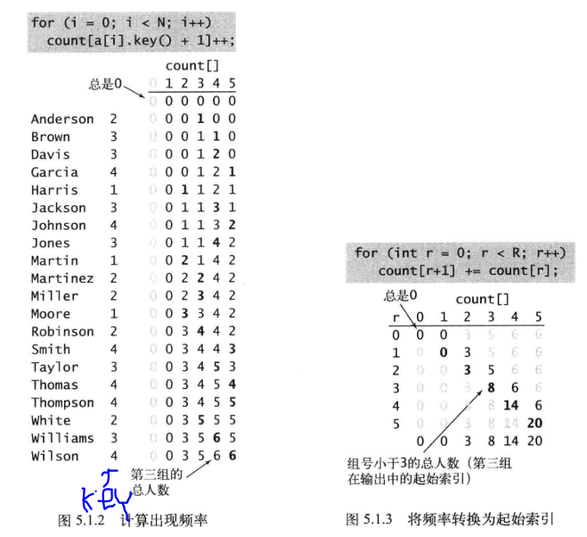
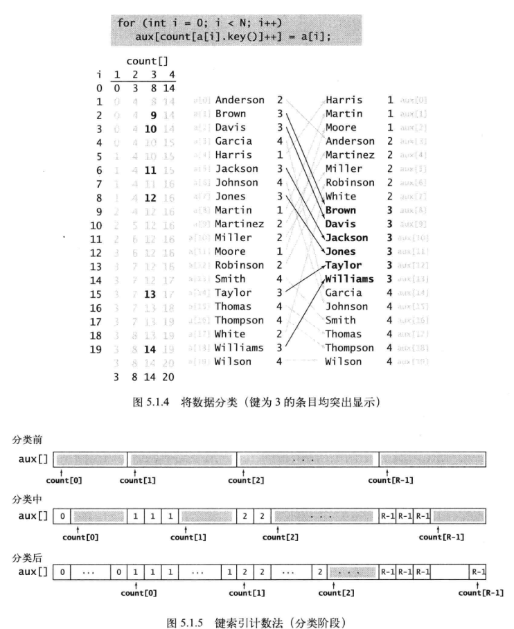

# 字符串排序

> 参考：算法（第四版）

## 键索引计数法

> 时间复杂度为$ O(N+R)$ ，其中R为key的范围

1. 频率统计
2. 将频率转换为索引
3. 数据分类
4. 回写







## 低位优先

```c++
void LowSort(vector<string> a, int W) {    //a为待排序字符串，W为字符串长度
    int N=(int)a.size();
    int R=256;  //当字符域在ascii范围内
    vector<string> aux(N);  //aux用来辅助存放结果，保证排序的稳定性
    for (int d=W-1;d>=0;d--){
        vector<int> count(R+1,0);
        for (int i=0;i<N;i++){  //计算出现频率
            count[a[i][d]+1]++;
        }
        for (int r=0;r<R;r++){  //将频率转换为索引
            count[r+1]+=count[r];
        }
        for (int i=0;i<N;i++) { //将元素分类
            aux[count[a[i][d]]++]=a[i];
        }
        for (int i=0;i<N;i++){  //回写
            a[i]=aux[i];
        }
    }
}
```

1. 排序具有稳定性
2. 比较适用于字符串长度一致的
3. 时间复杂度为 $O(WN)$ （当N远大于R)

## 高位优先

```c++
vector<string> a;
int N;
int M = 15;   //M为小数组的切换阈值，当待排序的区间规模比M小时，转换成STL
int R = 256;  //基数，当字符域在ascii范围内R=256
vector<string> aux;  //aux用来辅助存放结果，保证排序的稳定性

int index(string s, int d) { //返回字符s[d]对应的索引，方便压缩字符域，节省count空间
    return s[d];    //默认情况直接字符转ascii码
}

int cmp(string a, string b) { return a < b; };  //按字典序小到大

void InternalSort(int lo, int hi, int d) {
    if (hi <= lo + M) {  //区间长度小于阈值
        //常规排序,这里采用 STL sort + 自定义cmp 的方案,注意第二个参数要加一，末端迭代器是最后一位加一
        sort(a.begin() + lo, a.begin() + hi + 1, cmp);
        return;
    }
    vector<int> count(R + 2);
    for (int i = lo; i <= hi; i++) {   //计算频率
        count[index(a[i], d) + 2]++;
    }
    for (int r = 0; r < R + 1; r++) {    //将频率转换为索引
        count[r + 1] += count[r];
    }
    for (int i = lo; i <= hi; i++) {   //数据分类
        aux[count[index(a[i], d) + 1]++] = a[i];
    }
    for (int i = lo; i <= hi; i++) {   //回写
        a[i] = aux[i - lo];
    }

    //递归地以每个字符为键进行排序
    for (int r = 0; r < R; r++) {
        InternalSort(lo + count[r], lo + count[r + 1] - 1, d + 1);
    }
}

int main() {
    cin >> N;
    a.resize(N);
    aux.resize(N);
    for (int i = 0; i < N; i++) {
        cin >> a[i];
    }
    InternalSort(0, N - 1, 0);
    for (int i = 0; i < N; i++) {
        cout << a[i] << endl;
    }
    return 0;
}
```

1. 若不引入切换阈值，当hi-lo=1，即进行最后一趟排序时，每组用时为 $max(hi-lo,R)=R$ ，总共用时为 $ NR $ ，与低位优先的复杂度相当，为避免在最后几趟 $R>hi-lo$ 时带来的高额复杂度，引入切换阈值，当待排序区域为小数组时，切换成普通排序
2.   适用于字符串长度不一致的
3. 一般时间复杂度为$ O(N\log_R{N})$ ，近线性，证明见参考。 

# 前缀函数

```c++
string str;
vector<int> pi;

void prefix_function(string s) {
    int n = (int) s.length();
    pi.resize(n);
    for (int i = 1; i < n; i++) {
        int j = pi[i - 1];  //优化一，pi[i]最多比pi[i-1]大1，限制了上限
        while (j > 0 && s[i] != s[j]) j = pi[j - 1];   //优化二，j为s[0..i-1]下一个长的pi值，j存在状态转移方程
        if (s[i] == s[j]) j++;
        pi[i] = j;
    }
}

int main() {
    cin >> str;
    prefix_function(str);
    return 0;
}
```

$pi[i]$ 表示 $s[0..i]$ 中前缀字符串与后缀字符串相同的最长长度

# 最小表示法

优化主要思想：若两字符串前k-1位都一样，第k位不一样，那么下一次指针可以直接移动k+1位，而不用再一位一位移动


```c++
int k = 0, i = 0, j = 1;
while (k < n && i < n && j < n) {
  if (sec[(i + k) % n] == sec[(j + k) % n]) {
    k++;
  } else {
    //主要优化点
    sec[(i + k) % n] > sec[(j + k) % n] ? i = i + k + 1 : j = j + k + 1;	//若求最大表示把这句改成大于即可
    if (i == j) i++;
    k = 0;
  }
}
i = min(i, j);
```

