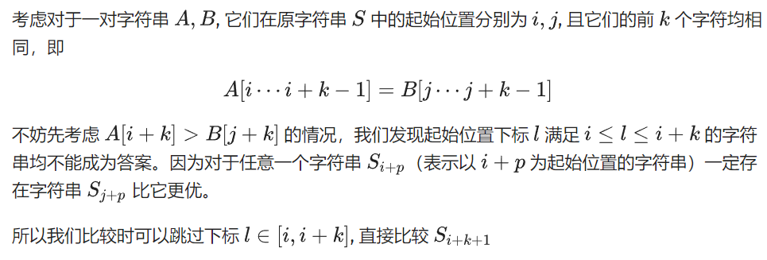

# 前缀函数

```c++
string str;
vector<int> pi;

void prefix_function(string s) {
    int n = (int) s.length();
    pi.resize(n);
    for (int i = 1; i < n; i++) {
        int j = pi[i - 1];  //优化一，pi[i]最多比pi[i-1]大1，限制了上限
        while (j > 0 && s[i] != s[j]) j = pi[j - 1];   //优化二，j为s[0..i-1]下一个长的pi值，j存在状态转移方程
        if (s[i] == s[j]) j++;
        pi[i] = j;
    }
}

int main() {
    cin >> str;
    prefix_function(str);
    return 0;
}
```

$pi[i]$ 表示 $s[0..i]$ 中前缀字符串与后缀字符串相同的最长长度

# 最小表示法

优化主要思想：若两字符串前k-1位都一样，第k位不一样，那么下一次指针可以直接移动k+1位，而不用再一位一位移动



```c++
int k = 0, i = 0, j = 1;
while (k < n && i < n && j < n) {
  if (sec[(i + k) % n] == sec[(j + k) % n]) {
    k++;
  } else {
    //主要优化点
    sec[(i + k) % n] > sec[(j + k) % n] ? i = i + k + 1 : j = j + k + 1;	//若求最大表示把这句改成大于即可
    if (i == j) i++;
    k = 0;
  }
}
i = min(i, j);
```

